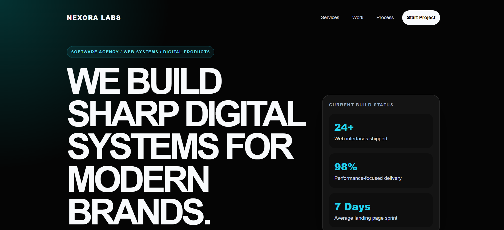

# Nexora Labs — Software Agency Landing Page

A modern software agency landing page built using only HTML and CSS.

This project was developed as part of the DecodeLabs Frontend Development Internship and demonstrates semantic HTML, responsive CSS, CSS Grid, Flexbox, and modern layout techniques.

---

## Live Demo

https://fazal305.github.io/decodelabs-static-agency/

---
## Screenshot



## Features

- Semantic HTML5 structure
- Mobile-first responsive design
- CSS Grid layouts
- Flexbox navigation and components
- Proper heading hierarchy
- Accessible page structure
- Hero section
- Services section
- Project showcase section
- Agency process section
- Contact call-to-action section
- Modern cyberpunk-inspired UI
- Fully responsive layout

---

## Technologies Used

- HTML5
- CSS3

---

## Project Structure

```text
decodelabs-static-agency/
│
├── index.html
├── style.css
├── README.md
├── LICENSE
└── .gitignore
```

---

## Learning Objectives

This project demonstrates:

- Semantic web development
- Responsive design principles
- CSS Grid layouts
- Flexbox alignment
- Clean code organization
- Mobile-first development
- Professional landing page structure

---

## DecodeLabs Requirements Covered

- Semantic HTML
- External CSS only
- Responsive design
- CSS Grid
- Flexbox
- Proper heading hierarchy
- Accessible images
- Mobile-first approach
- Clean reusable styling

---

## Author

Fazal Abbas

GitHub:
https://github.com/fazal305

LinkedIn:
https://www.linkedin.com/in/fazal-abbas-4653dg86

---

## License

This project is licensed under the MIT License.